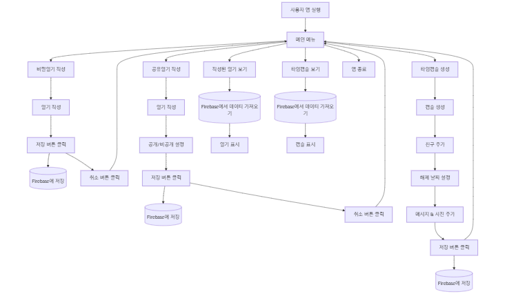
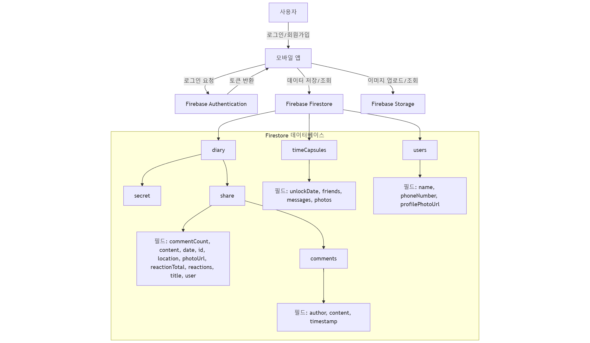

## 📌 프로젝트 소개
2024-2학기 모바일소프트웨어 프로젝트

소중한 순간과 기억을 기록하는, “모멘토리”

##  프로젝트 정의
“모멘토리”는 친구들과 함께 추억을 기록 할 수 있는 공유일기, 개인만의 공간에서 자유롭게 기록할 수
있는 비밀일기, 그리고 특별한 순간을 간직하는 타임캡슐 기능을 결합한 앱입니다. 이 앱은 사용자가 소중한
일상을 기록하고 간직하며, 원하는 대로 친구들과 공유하거나 나만의 공간에 간직할 수 있도록
설계되었습니다. 바쁜 일상 속에 지나치기 쉬운 순간들이 “모멘토리”를 통해 기록됩니다.
타임캡슐 기능은 정해진 날짜에 오래된 추억을 열어보는 설렘을 제공하며, 공유일기 기능을 사용하여
소한한 일상을 친구들과 함께 나누고, 과거에 작성된 공유일기를 다시보며 그떄의 감정을 다시금 떠올릴 수
있게 합니다. 반면, 비밀일기 기능은 공개되지 않은 나만의 추억을 자유롭게 기록할 수 있어 감정을
배출하면서도 이를 안전하게 보관할 수 있는 공간을 제공합니다

---
## 📊 시스템 플로우차트

